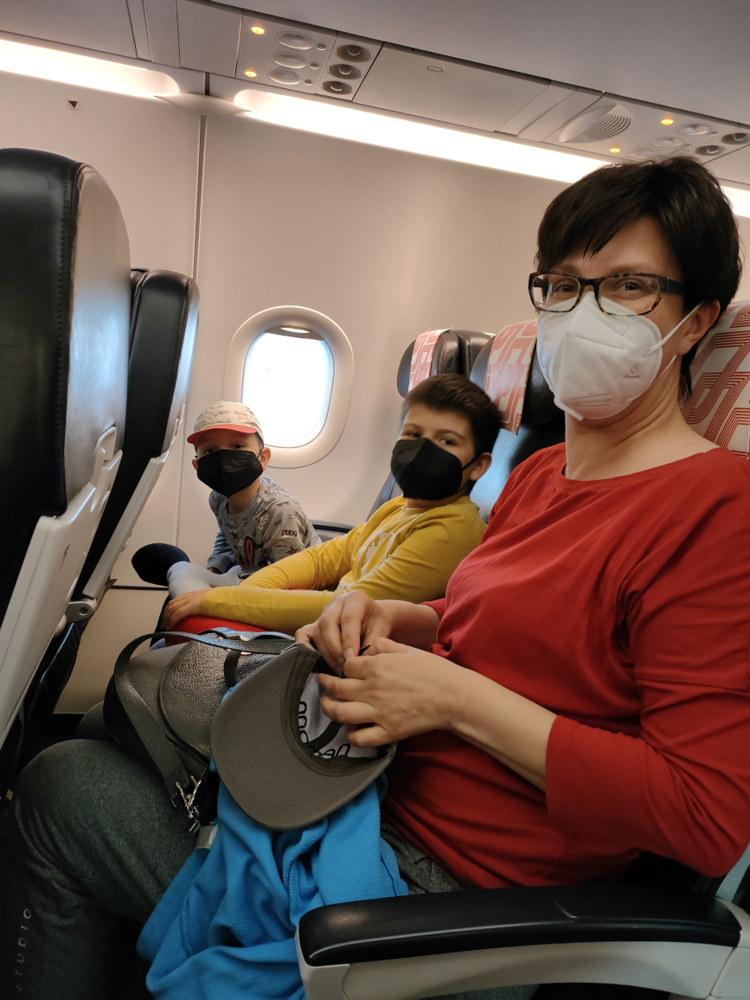

```{r setup, include=FALSE}
knitr::opts_chunk$set(echo = TRUE, eval = TRUE) #, knitr.table.format = 'latex')
library(tidyverse)
library(knitr)
library(kableExtra)
# options(width=45)
#options(width = 90)
options(width = 70)
knitr::opts_chunk$set(fig.pos = 'H')

# Making some aesthetic changes for this document
theme_set(theme_gray(base_size = 9))
update_geom_defaults("point", list(size = 0.5))
update_geom_defaults("boxplot", list(outlier.size = 0.5))
```

```{r xaringan-themer, include=FALSE}
library(xaringanthemer)
# solarized_dark(
#   code_font_family = "Fira Code",
#   code_font_url    = "https://cdn.rawgit.com/tonsky/FiraCode/1.204/distr/fira_code.css"
# )
style_mono_accent(
  base_color = "#DA291C",
  #base_color = "#e69e33",
  header_font_google = google_font("Muli"),
  text_font_google   = google_font("Muli", "300", "300i"),
  code_font_google   = google_font("Droid Mono")
)
```
class: inverse, center, middle
# Gdzie jest Chile?

---
background-image: url("img/mapa1.jpg")
background-size: contain
```{r, echo = F}
#knitr::include_graphics("img/pca-lda2.png")
```


---
background-image: url("img/mapa2.jpg")
background-size: contain

---
```{r xaringan-scribble, echo=FALSE}
xaringanExtra::use_scribble(pen_size = 20, eraser_size = 20)
```

```{r xaringan-logo, echo=FALSE}
xaringanExtra::use_logo(
  image_url = "img/logo2.png",
  exclude_class = NULL
)
```

.pull-left[
# Chile położone jest w Ameryce Południowej
]
.pull-right[
```{r, echo = F, out.width = "90%"}

```
]

---
# Flaga Chile
```{r, echo = F, out.width = "70%"}

```

---
# Flaga Chile
```{r, echo = F, out.width = "70%"}

```

---
# Kto ma więcej mieszkańców?

.pull-left[
```{r, echo = F, out.width = "90%"}

```
]
.pull-right[
```{r, echo = F, out.width = "90%"}
knitr::include_graphics("img/pol.svg")
```
]

---
.pull-left[
# 18 307 925
```{r, echo = F, out.width = "90%"}

```
]
.pull-right[
# 38 179 800
```{r, echo = F, out.width = "90%"}
knitr::include_graphics("img/pol.svg")
```
]

---
# W jakim języku mówią Chilijczycy?

--

## Po hiszpańsku!

```{r, echo = F, out.width = "60%"}

```

---
.pull-left[
# Jak dostać się do Chile?

[Samolotem!](https://www.flightradar24.com/data/flights/af406#2c3bf8d8)

*Podróż: Suchy Las- Berlin-Paryż-Santiago-Curico*

*Podróż zajęła 28 godzin =1 dzień i 4 godziny*
]
.pull-right[
<br><br><br>
```{r, echo = F, out.width = "100%"}

```
]

---
# Jak dostać się do Chile?

.pull-left[
```{r, echo = F, out.width = "90%"}

```
]
.pull-right[
```{r, echo = F, out.width = "90%"}

```
]

---
# Jak dostać się do Chile?

```{r, echo = F, out.width = "80%"}

```

---
# Jak dostać się do Chile?

```{r, echo = F, out.width = "40%"}

```

---
# Czy wiedziałeś?

.pull-left[
```{r, echo = F, out.width = "100%"}

```
]

.pull-right[
## Kiedy w Polsce jest wiosna w Chile jest JESIEŃ

## Kiedy w Polsce jest lato w Chile jest ...
]

---
# Czy wiedziałeś?

.pull-left[
```{r, echo = F, out.width = "100%"}

```
]

.pull-right[

### Jak w Polsce jest lato to różnica w czasie między Polską a Chile wynosi 6 godzin.

Jak w Polsce jest 12:00 w południe to w Chile jest 6:00 rano tego samego dnia.

### Jak w Polsce jest zima to różnica w czasie między Polską a Chile wynosi 4 godziny.

Jak w Polsce jest 12:00 w południe to w Chile jest 8:00 rano tego samego dnia


]

---
class: inverse, center, middle
# Jak wygląda Chile?

---
# Santiago

```{r, echo = F, out.width = "90%"}

```

---
# Pustynia Atacama

.pull-left[
```{r, echo = F, out.width = "70%"}

```
]

.pull-right[
```{r, echo = F, out.width = "100%"}

```
Atacama to najbardziej suche miejsce na świecie!
]

---
# Ocean Spokojny

<video width="800" controls autoplay>
<source src="img/mar.mp4" type="video/mp4">
</video>

---
# Andy

```{r, echo = F, out.width = "80%"}

```

---
# Wulkany

.pull-left[
```{r, echo = F, out.width = "80%"}

```
]
.pull-right[
## W Chile znajduje się 2000 wulkanów, z których ponad 500 według ekspertów jest potencjalnie aktywnych.
]

---
# Huilo Huilo

.pull-left[
```{r, echo = F, out.width = "70%"}

```
]

.pull-right[
```{r, echo = F, out.width = "100%"}

```
]

---
# Wyspa Wielkanocna

```{r, echo = F, out.width = "80%"}

```

---
# Antarktyka Chilijska

```{r, echo = F, out.width = "90%"}
knitr::include_graphics("img/ant.jpg")
```


---
class: inverse, center, middle
# Tradycje

---
# Cueca

<iframe width="950" height="500" src="https://www.youtube.com/embed/6062aKDLduI" title="YouTube video player" frameborder="0" allow="accelerometer; autoplay; clipboard-write; encrypted-media; gyroscope; picture-in-picture" allowfullscreen></iframe>

---
# Chinchineros

<iframe width="950" height="500" src="https://www.youtube.com/embed/wOiXkEzcY-c" title="YouTube video player" frameborder="0" allow="accelerometer; autoplay; clipboard-write; encrypted-media; gyroscope; picture-in-picture" allowfullscreen></iframe>

---
# Empanadas

```{r, echo = F, out.width = "80%"}

```

---
# Volantines

```{r, echo = F, out.width = "80%"}

```

---
# Emboque

```{r, echo = F, out.width = "60%"}

```

---
class: inverse, center, middle
# Pozdrowienia!
# Saludos!
```{r, echo = F, out.width = "40%"}

```
